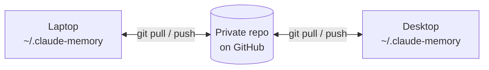

# claude-memory-sync

[](https://github.com/tahabozdemir/claude-memory-sync/actions/workflows/test.yml)
[](LICENSE)


Keep Claude Code's **auto memory** in sync across all your machines, through a private git repository you own.

**[Türkçe rehber →](README.tr.md)**

Claude Code's [auto memory](https://code.claude.com/docs/en/memory#auto-memory) is machine-local. What Claude learns about you and your projects on your laptop never reaches your desktop, and the docs say so directly: *"Files are not shared across machines or cloud environments."* Zipping `~/.claude/projects/*/memory` and unpacking it on the other machine gets old fast.

claude-memory-sync stores each project's memory in a private git repo and syncs it automatically through Claude Code hooks. After a one-time setup there's nothing to remember.

> Community project, not affiliated with Anthropic. It uses only documented Claude Code features: the [`autoMemoryDirectory`](https://code.claude.com/docs/en/memory#storage-location) setting and [hooks](https://code.claude.com/docs/en/hooks).

## How it works



- **`link`** points the project's `autoMemoryDirectory` at `~/.claude-memory/projects/<name>/` (in `.claude/settings.local.json`). Claude reads and writes memory there as usual.
- **Three hooks** in `~/.claude/settings.json` keep that folder in sync:

| Hook | What it does |
| --- | --- |
| `SessionStart` | Pulls. If memory changed on another machine, it gives the updated `MEMORY.md` to Claude in the same session. Claude Code loads memory before this hook runs, so this step is needed. |
| `Stop` (async) | After each Claude response, commits and pushes if memory changed. It runs in the background, so you never wait for it. |
| `SessionEnd` | One last push when you exit. |

There's no daemon or background service. Nothing leaves your machine except git traffic to your own remote.

## Requirements

- macOS or Linux (on Windows, use WSL)
- `git`, `jq`, `bash` 3.2 or newer
- A recent Claude Code with the `autoMemoryDirectory` setting (tested with 2.1.283)

## Setup

### 1. Create a private repository (once)

```bash
gh repo create claude-memory --private
```

Or on github.com: **New repository → Private**, with no README.

### 2. Install (on every machine)

```bash
curl -fsSL https://raw.githubusercontent.com/tahabozdemir/claude-memory-sync/main/install.sh | bash
```

or

```bash
git clone https://github.com/tahabozdemir/claude-memory-sync.git
cd claude-memory-sync && ./install.sh
```

This installs one script to `~/.local/bin/claude-memory-sync`.

### 3. Connect the machine

```bash
claude-memory-sync init git@github.com:<you>/claude-memory.git
```

This clones the repo to `~/.claude-memory` and adds the hooks to `~/.claude/settings.json`. A backup of that file is saved first, as `settings.json.bak-claude-memory-sync`.

### 4. Link your projects

```bash
cd ~/code/my-app
claude-memory-sync link
```

The memory Claude already has for this project on this machine is moved into the sync repo. The original folder is left untouched as a backup. Restart any Claude Code session running in that project.

### On your other machines

Repeat steps 2–4 with the **same repository URL**. `link` names the project after its git `origin` (or its folder name if there's no remote), so both machines agree on the name even if the project sits at a different path. If the names still differ, pick one yourself:

```bash
claude-memory-sync link my-app
```

If both machines already had memories for the project, they're combined. Nothing is overwritten; see [conflicts](#when-both-machines-change-the-same-thing).

## Daily use

Nothing to do. Work in Claude Code as usual on either machine. To check on things:

```bash
claude-memory-sync status
```

```
claude-memory-sync 0.1.1
  Sync repo:   ~/.claude-memory
  Remote:      git@github.com:you/claude-memory.git (main)
  Last sync:   2026-09-28 14:02:11
  Hooks:       installed in ~/.claude/settings.json
  Pending:     nothing, everything is pushed
  This folder: linked as 'my-app'
  Projects:    my-app (26), website (4)
```

## When both machines change the same thing

| Situation | Result |
| --- | --- |
| Both machines add memories | Merged automatically. `MEMORY.md` merges line by line (git's `union` driver). |
| Both machines edit the **same** memory file | Nothing is lost. The other machine's version stays in place, and this machine's version is saved next to it as `name.conflict-<machine>.md`. At the next session start, Claude is told about it and can merge the two. |
| One machine deletes a file, the other edits it | The edit wins. |
| Offline | Changes are committed locally and pushed at the next sync. Claude is told that memories from other machines may be missing. |

A sync never stops to ask you anything, and never leaves the repo half-merged.

## Commands

| Command | Description |
| --- | --- |
| `init <git-url>` | Set up this machine: clone the repo, install the hooks. Options: `--no-hooks`, `--allow-public` |
| `link [name]` | Sync the current project's memory (run it in the project folder) |
| `unlink` | Stop syncing this project on this machine. The memory is copied back to Claude's default folder. |
| `sync` | Sync now (the hooks do this for you) |
| `status` | Show what's linked and whether anything is pending |
| `install-hooks` / `uninstall-hooks` | Add or remove the Claude Code hooks |

## Files it touches

| Path | What |
| --- | --- |
| `~/.claude-memory/` | The sync repo (change the location with `CLAUDE_MEMORY_SYNC_DIR`) |
| `~/.claude/settings.json` | The three hooks (use `CLAUDE_CONFIG_DIR` if your Claude Code config lives elsewhere) |
| `<project>/.claude/settings.local.json` | `autoMemoryDirectory`. Added to `.git/info/exclude`, so it's never committed to your project. |

The sync repo looks like this:

```
claude-memory/
├── .gitattributes          # MEMORY.md merge=union
└── projects/
    ├── my-app/
    │   ├── MEMORY.md       # index, loaded at every session start
    │   └── *.md            # one file per memory
    └── website/
```

## Privacy

Memories can contain details about your work, your preferences and your projects. **Always use a private repository.** When the GitHub CLI (`gh`) is installed, `init` refuses a public GitHub repo unless you pass `--allow-public`.

## Troubleshooting

- **Claude doesn't see memories from the other machine.** Run `claude-memory-sync status` in the project and check that it says `linked`. Start Claude from the project root (the folder where you ran `link`), and restart any session that was running before you linked.
- **Hooks don't seem to run.** Run `claude-memory-sync install-hooks`, then check `/hooks` inside Claude Code.
- **The project isn't trusted.** Claude Code only applies `autoMemoryDirectory` from project settings in folders you've trusted.
- **Push/pull fails with SSH.** Hooks run without a terminal, so they can't ask for a key passphrase. Load your key into `ssh-agent` (on macOS, `UseKeychain yes`), or use an HTTPS remote with `gh auth setup-git`.
- **Logs.** See `~/.claude-memory/.git/claude-memory-sync.log`.

## Uninstall

```bash
cd ~/code/my-app && claude-memory-sync unlink   # in each linked project
claude-memory-sync uninstall-hooks
rm ~/.local/bin/claude-memory-sync
rm -rf ~/.claude-memory                          # optional: the local copy of the repo
```

## FAQ

**Why not just put the memory folder in iCloud Drive or Dropbox?** That works for one person on one machine at a time. When two machines write at once, `MEMORY.md` ends up as `MEMORY 2.md` and one side's changes quietly fall out of the index. Git merges both sides, keeps history (`git log -p projects/my-app`) and lets you undo a bad memory.

**Does it sync `CLAUDE.md`?** No. Project `CLAUDE.md` files belong in the project's own repository. This tool only syncs the notes Claude writes for itself.

**Is there an official way to do this?** Not as of Claude Code 2.1.283. Auto memory is documented as machine-local.

## Development

```bash
bash tests/test.sh
shellcheck bin/claude-memory-sync install.sh tests/test.sh
```

The tests simulate two machines (separate `HOME`s) sharing one bare remote. They cover linking, merging, conflicts, delete versus edit, offline mode, and hook installation.

See [CONTRIBUTING.md](CONTRIBUTING.md) before opening a pull request, and [SECURITY.md](SECURITY.md) to report a vulnerability. Changes are listed in [CHANGELOG.md](CHANGELOG.md).

## License

[MIT](LICENSE)
