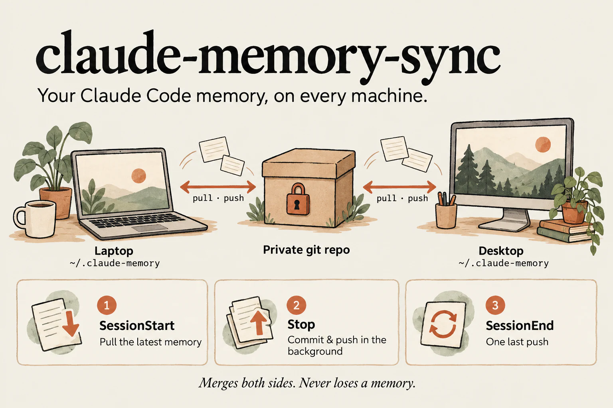
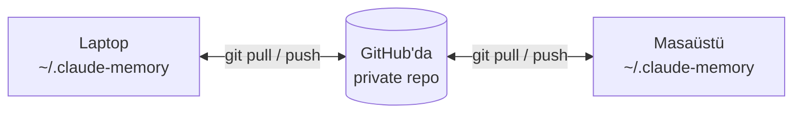

# claude-memory-sync

[](https://github.com/tahabozdemir/claude-memory-sync/actions/workflows/test.yml)
[](LICENSE)



Claude Code'un **auto memory**'sini (otomatik hafızasını) tüm bilgisayarlarında senkronize tutar. Bunu kendine ait private bir git reposu üzerinden yapar.

**[English →](README.md)**

Claude Code'un [auto memory](https://code.claude.com/docs/en/memory#auto-memory) özelliği bilgisayara özeldir. Claude'un laptopunda seninle ve projelerinle ilgili öğrendikleri masaüstü bilgisayarına geçmez. Resmi dokümantasyon da bunu açıkça söylüyor: *"Files are not shared across machines or cloud environments."* `~/.claude/projects/*/memory` klasörünü zipleyip diğer bilgisayarda açmak da bir süre sonra yorucu oluyor.

claude-memory-sync her projenin hafızasını private bir git reposunda tutar ve Claude Code hook'larıyla otomatik senkronize eder. Bir kez kurduktan sonra hatırlaman gereken hiçbir adım yok.

> Topluluk projesidir, Anthropic ile bir bağlantısı yoktur. Yalnızca Claude Code'un dokümante edilmiş özelliklerini kullanır: [`autoMemoryDirectory`](https://code.claude.com/docs/en/memory#storage-location) ayarı ve [hook'lar](https://code.claude.com/docs/en/hooks).

## Nasıl çalışır?



- **`link`** komutu, projenin `autoMemoryDirectory` ayarını `~/.claude-memory/projects/<isim>/` klasörüne yönlendirir (`.claude/settings.local.json` içinde). Claude hafızayı her zamanki gibi okuyup yazar, sadece artık bu klasörü kullanır.
- `~/.claude/settings.json` içine eklenen **üç hook** bu klasörü senkronize tutar:

| Hook | Ne yapar |
| --- | --- |
| `SessionStart` | Değişiklikleri çeker (pull). Başka bilgisayarda hafıza değiştiyse güncel `MEMORY.md`'yi Claude'a aynı oturumda iletir. Claude Code hafızayı bu hook'tan önce yüklüyor, bu yüzden bu adım gerekli. |
| `Stop` (async) | Claude'un her cevabından sonra, hafıza değiştiyse commit + push yapar. Arka planda çalıştığı için hiç beklemezsin. |
| `SessionEnd` | Çıkarken son bir push yapar. |

Arka planda sürekli çalışan bir servis yoktur. Kendi git remote'un dışında hiçbir yere veri gönderilmez.

## Gereksinimler

- macOS veya Linux (Windows'ta WSL ile)
- `git`, `jq`, `bash` 3.2 veya üstü
- `autoMemoryDirectory` ayarını destekleyen güncel bir Claude Code (2.1.283 ile test edildi)

## Kurulum

### 1. Private bir repo oluştur (bir kez)

```bash
gh repo create claude-memory --private
```

Ya da github.com'da: **New repository → Private**, README eklemeden.

### 2. Yükle (her bilgisayarda)

```bash
curl -fsSL https://raw.githubusercontent.com/tahabozdemir/claude-memory-sync/main/install.sh | bash
```

veya

```bash
git clone https://github.com/tahabozdemir/claude-memory-sync.git
cd claude-memory-sync && ./install.sh
```

Tek bir script `~/.local/bin/claude-memory-sync` konumuna kurulur.

### 3. Bilgisayarı bağla

```bash
claude-memory-sync init git@github.com:<kullanici-adin>/claude-memory.git
```

Repo `~/.claude-memory` klasörüne klonlanır ve hook'lar `~/.claude/settings.json` dosyasına eklenir. Eklemeden önce dosyanın yedeği `settings.json.bak-claude-memory-sync` adıyla alınır.

### 4. Projelerini bağla

```bash
cd ~/code/uygulamam
claude-memory-sync link
```

Claude'un bu bilgisayarda o proje için tuttuğu hafıza, senkronizasyon reposuna taşınır. Orijinal klasöre dokunulmaz, yedek olarak kalır. O projede açık bir Claude Code oturumu varsa yeniden başlat.

### Diğer bilgisayarlarında

2–4. adımları **aynı repo adresiyle** tekrarla. `link`, projeye git `origin` adını verir (remote yoksa klasör adını). Böylece proje iki bilgisayarda farklı yollarda olsa bile aynı isimle eşleşir. İsimler yine de farklı çıkarsa ismi kendin ver:

```bash
claude-memory-sync link uygulamam
```

İki bilgisayarda da o projeye ait hafıza zaten varsa ikisi birleştirilir. Hiçbir şeyin üzerine yazılmaz; ayrıntılar aşağıdaki "İki bilgisayar aynı şeyi değiştirirse" bölümünde.

## Günlük kullanım

Yapman gereken bir şey yok. İki bilgisayarda da Claude Code'u her zamanki gibi kullan. Durumu görmek istersen:

```bash
claude-memory-sync status
```

```
claude-memory-sync 0.1.1
  Sync repo:   ~/.claude-memory
  Remote:      git@github.com:sen/claude-memory.git (main)
  Last sync:   2026-09-28 14:02:11
  Hooks:       installed in ~/.claude/settings.json
  Pending:     nothing, everything is pushed
  This folder: linked as 'uygulamam'
  Projects:    uygulamam (26), website (4)
```

## İki bilgisayar aynı şeyi değiştirirse

| Durum | Sonuç |
| --- | --- |
| İki bilgisayar da yeni hafıza ekledi | Otomatik birleştirilir. `MEMORY.md` satır satır birleşir (git'in `union` sürücüsü). |
| İki bilgisayar da **aynı** hafıza dosyasını düzenledi | Hiçbir şey kaybolmaz. Diğer bilgisayarın versiyonu yerinde kalır, bu bilgisayarın versiyonu yanına `isim.conflict-<bilgisayar>.md` adıyla kaydedilir. Bir sonraki oturum başında Claude'a bu durum bildirilir ve ikisini birleştirebilir. |
| Bir bilgisayar dosyayı sildi, diğeri düzenledi | Düzenleme kazanır. |
| İnternet yok | Değişiklikler yerelde commit'lenir, bir sonraki senkronizasyonda push edilir. Claude'a diğer bilgisayarlardaki hafızaların eksik olabileceği söylenir. |

Senkronizasyon hiçbir zaman durup sana soru sormaz ve repoyu yarım kalmış bir merge durumunda bırakmaz.

## Komutlar

| Komut | Açıklama |
| --- | --- |
| `init <git-url>` | Bilgisayarı kurar: repoyu klonlar, hook'ları ekler. Seçenekler: `--no-hooks`, `--allow-public` |
| `link [isim]` | Bulunduğun projenin hafızasını senkronize etmeye başlar (proje klasöründe çalıştır) |
| `unlink` | Bu bilgisayarda projenin senkronizasyonunu durdurur. Hafıza, Claude'un varsayılan klasörüne geri kopyalanır. |
| `sync` | Hemen senkronize eder (hook'lar bunu zaten senin yerine yapar) |
| `status` | Nelerin bağlı olduğunu ve bekleyen bir şey olup olmadığını gösterir |
| `install-hooks` / `uninstall-hooks` | Claude Code hook'larını ekler veya kaldırır |

## Dokunduğu dosyalar

| Yol | Ne |
| --- | --- |
| `~/.claude-memory/` | Senkronizasyon reposu (konumu `CLAUDE_MEMORY_SYNC_DIR` ile değiştirilebilir) |
| `~/.claude/settings.json` | Üç hook (Claude Code ayarların başka bir yerdeyse `CLAUDE_CONFIG_DIR` kullan) |
| `<proje>/.claude/settings.local.json` | `autoMemoryDirectory` ayarı. `.git/info/exclude` dosyasına eklenir, yani projenin reposuna asla commit'lenmez. |

Senkronizasyon reposu şöyle görünür:

```
claude-memory/
├── .gitattributes          # MEMORY.md merge=union
└── projects/
    ├── uygulamam/
    │   ├── MEMORY.md       # indeks, her oturum başında yüklenir
    │   └── *.md            # her hafıza için bir dosya
    └── website/
```

## Gizlilik

Hafızalar işin, tercihlerin ve projelerin hakkında ayrıntılar içerebilir. **Mutlaka private bir repo kullan.** GitHub CLI (`gh`) kuruluysa `init` komutu public bir GitHub reposunu reddeder; `--allow-public` vermeden kurulmaz.

## Sorun giderme

- **Claude diğer bilgisayardaki hafızayı görmüyor.** Projede `claude-memory-sync status` çalıştır ve `linked` yazdığını kontrol et. Claude'u proje kök klasöründen (`link` çalıştırdığın yerden) başlat. `link`'ten önce açılmış oturumları yeniden başlat.
- **Hook'lar çalışmıyor gibi görünüyor.** `claude-memory-sync install-hooks` çalıştır, sonra Claude Code içinde `/hooks` ile kontrol et.
- **Klasör güvenilir (trusted) değil.** Claude Code, proje ayarlarındaki `autoMemoryDirectory` değerini sadece güvendiğin klasörlerde uygular.
- **SSH ile push/pull başarısız oluyor.** Hook'lar terminal olmadan çalıştığı için anahtar şifresi soramaz. Anahtarını `ssh-agent`'a ekle (macOS'ta `UseKeychain yes`) ya da HTTPS remote kullanıp `gh auth setup-git` çalıştır.
- **Loglar:** `~/.claude-memory/.git/claude-memory-sync.log`

## Kaldırma

```bash
cd ~/code/uygulamam && claude-memory-sync unlink   # bağlı her projede
claude-memory-sync uninstall-hooks
rm ~/.local/bin/claude-memory-sync
rm -rf ~/.claude-memory                             # isteğe bağlı: reponun yerel kopyası
```

## SSS

**Neden hafıza klasörünü iCloud Drive'a ya da Dropbox'a koymuyoruz?** Aynı anda tek bir bilgisayar kullanıyorsan işe yarar. İki bilgisayar aynı anda yazdığında `MEMORY.md`, `MEMORY 2.md` gibi kopyalara bölünür ve bir tarafın değişiklikleri sessizce indeksten düşer. Git ise iki tarafı birleştirir, geçmişi tutar (`git log -p projects/uygulamam`) ve hatalı bir hafızayı geri almanı sağlar.

**`CLAUDE.md` dosyalarını da senkronize ediyor mu?** Hayır. Projenin `CLAUDE.md` dosyası zaten projenin kendi reposunda durmalı. Bu araç sadece Claude'un kendisi için yazdığı notları senkronize eder.

**Bunun resmi bir yolu var mı?** Claude Code 2.1.283 itibarıyla yok. Auto memory dokümantasyonda bilgisayara özel (machine-local) olarak tanımlanıyor.

## Geliştirme

```bash
bash tests/test.sh
shellcheck bin/claude-memory-sync install.sh tests/test.sh
```

Testler, aynı bare remote'u paylaşan iki bilgisayarı (ayrı `HOME` klasörleriyle) simüle eder. Kapsadıkları: link, birleştirme, çakışmalar, silme–düzenleme çakışması, internetsiz çalışma ve hook kurulumu.

Pull request açmadan önce [CONTRIBUTING.md](CONTRIBUTING.md) dosyasına göz at. Güvenlik açıklarını [SECURITY.md](SECURITY.md) üzerinden bildirebilirsin. Değişiklikler [CHANGELOG.md](CHANGELOG.md) dosyasında listelenir.

## Lisans

[MIT](LICENSE)
